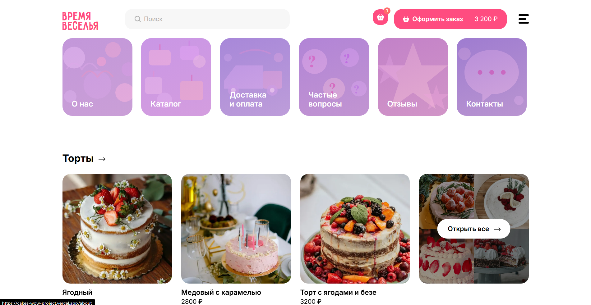
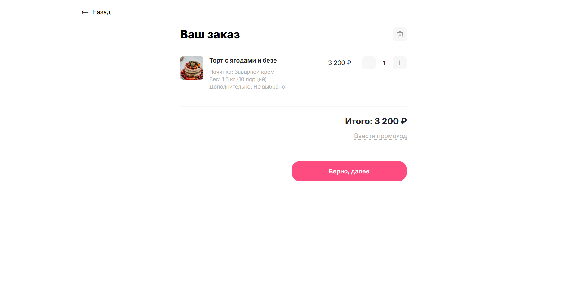

# Cakes Project

Веб-приложение для кондитерской — каталог тортов и бенто-тортов с возможностью оформления заказа.

## Фичи

-   **Каталог тортов** с фильтрацией и сортировкой (по цене, популярности)
-   **Карточка торта** с интерактивным выбором:
    -   Начинки (множественный выбор)
    -   Вес (1.5кг, 3кг, 5кг с надбавкой)
    -   Дополнительные опции (свечи, украшения)
-   **Калькулятор цены** в реальном времени
-   **Корзина** с сохранением в localStorage
-   **Промокоды** (скидка 15%)
-   **Интерактивная карта** с маршрутом до магазина (Leaflet)
-   **Lazy Loading** страниц для оптимизации загрузки
-   **Responsive дизайн** (брейкпоинты: 1200px, 992px, 767px, 576px)

## Live Demo

[View Live](https://cakes-wow-project.vercel.app)

## Screenshots

### Главная страница



### Каталог тортов


### Карточка торта


### Корзина



## Технологии

| Категория        | Стек                                 |
| ---------------- | ------------------------------------ |
| Фреймворк        | React 18, TypeScript 4.8             |
| Сборка           | Vite 3                               |
| State Management | Redux Toolkit                        |
| Роутинг          | React Router DOM 6                   |
| Стилизация       | SCSS + CSS Modules                   |
| Карты            | Leaflet, React Leaflet               |
| Тестирование     | Jest 29, Testing Library             |
| Линтинг          | ESLint (Airbnb), Stylelint, Prettier |
| CI               | GitHub Actions                       |

## Установка и запуск

```bash
# Клонирование
git clone https://github.com/Siegerus/cakes_project.git
cd cakes_project

# Установка зависимостей
npm install

# Запуск dev-сервера (localhost:3000)
npm run dev
```

## Бэкенд

Серверная часть на **Node.js + Express + TypeScript**. Отвечает за:

-   хранение и отдачу каталога тортов (`/api/offers`);
-   валидацию и сохранение заказов в SQLite (`POST /api/orders`);
-   обработку промокодов (`POST /api/promo`);
-   эмуляцию приёма платежей (`/api/payment/*`);
-   отправку уведомлений в Telegram и email.

### Стек

| Категория    | Стек                                   |
| ------------ | -------------------------------------- |
| Язык         | TypeScript 5                           |
| Фреймворк    | Express 4                              |
| Безопасность | `helmet`, `cors`, `express-rate-limit` |
| Валидация    | Zod                                    |
| База данных  | SQLite через `sql.js`                  |
| Уведомления  | Nodemailer, Telegram Bot API           |

### Структура проекта

```
backend/
├── src/
│   ├── config.ts          # Переменные окружения, валидация
│   ├── index.ts           # Точка входа, middleware, роутинг
│   ├── db.ts              # Подключение к SQLite, чтение/запись
│   ├── data/
│   │   └── offers.json    # Данные каталога тортов
│   ├── middleware/
│   │   └── idempotency.ts # Защита от дублирования заказов
│   ├── routes/
│   │   ├── offers.ts      # GET /api/offers
│   │   ├── orders.ts      # POST /api/orders
│   │   ├── promo.ts       # POST /api/promo
│   │   └── payment.ts     # POST /api/payment и вспомогательные эндпоинты
│   ├── services/
│   │   ├── email.ts       # Отправка email-уведомлений
│   │   └── telegram.ts    # Отправка в Telegram
│   ├── types/
│   │   └── order.ts       # TypeScript-типы заказа
│   └── utils/
│       ├── validation.ts  # Zod-схемы
│       ├── orderMapper.ts # Маппинг фронтендового формата в DTO
│       └── discount.ts    # Расчёт скидок
├── package.json
├── tsconfig.json
├── .env.example
└── .gitignore
```

### Переменные окружения

Файл: `backend/.env`

| Переменная           | Обязательная | Назначение                                                                       |
| -------------------- | ------------ | -------------------------------------------------------------------------------- |
| `TELEGRAM_BOT_TOKEN` | да           | Токен Telegram-бота                                                              |
| `TELEGRAM_CHAT_ID`   | да           | ID чата для уведомлений                                                          |
| `EMAIL_USER`         | нет          | Почта для отправки уведомлений                                                   |
| `EMAIL_APP_PASSWORD` | нет          | Пароль приложения для почты                                                      |
| `PORT`               | нет          | Порт сервера (по умолчанию `4000`)                                               |
| `DB_PATH`            | нет          | Путь к файлу SQLite (по умолчанию `backend/cakes.db`)                            |
| `CORS_ORIGIN`        | нет          | Разрешённые источники CORS (через запятую, по умолчанию `http://localhost:3000`) |
| `DISCOUNT_PERCENT`   | нет          | Процент скидки по промокоду (по умолчанию `15`)                                  |

Шаблон: `backend/.env.example`.

### API

Базовый путь: `/api` (порт по умолчанию `4000`).

#### Эндпоинты

| Метод | Путь                             | Назначение                             |
| ----- | -------------------------------- | -------------------------------------- |
| GET   | `/api/offers`                    | Получить каталог тортов                |
| POST  | `/api/promo`                     | Проверить промокод и рассчитать скидку |
| POST  | `/api/orders`                    | Создать заказ                          |
| POST  | `/api/payment`                   | Создать платёж                         |
| GET   | `/api/payment/pay/:paymentId`    | HTML-страница эмуляции оплаты (iframe) |
| POST  | `/api/payment/confirm`           | Подтвердить/отменить платёж            |
| GET   | `/api/payment/status/:paymentId` | Получить статус платежа                |

Также доступен health-check: `GET /health` → `{ "status": "ok" }`.

#### Примеры запросов

**Получение каталога**

```http
GET /api/offers
```

Ответ `200`:

```json
[
	{
		"id": "1",
		"isBento": false,
		"price": 2500,
		"filling": [{ "name": "Шоколадная", "price": 300 }],
		"optionally": [{ "name": "Свечи", "price": 150 }]
	}
]
```

**Проверка промокода**

```http
POST /api/promo
Content-Type: application/json

{
  "code": "CAKES15",
  "shoppingCart": [
    {
      "price": 2500,
      "quantity": 2
    }
  ]
}
```

Ответ `200`:

```json
{
	"valid": true,
	"discount": 15,
	"originalSum": 5000,
	"discountedSum": 4250
}
```

**Создание заказа**

```http
POST /api/orders
Content-Type: application/json

{
  "shoppingCart": [
    {
      "orderId": "abc-123",
      "cakeId": "1",
      "title": "Торт «Медовик»",
      "image": "/images/cake-1.jpg",
      "weight": [
        { "weightValue": 3, "isChecked": true }
      ],
      "filling": {
        "Шоколадная": true
      },
      "optional": {
        "Свечи": true
      },
      "price": 3050,
      "quantity": 1
    }
  ],
  "userData": {
    "name": "Иван Иванов",
    "phone": "+79991234567",
    "address": "г. Москва, ул. Примерная, 1",
    "comment": "Позвонить за час"
  },
  "finalSum": 3050
}
```

Ответ `201`:

```json
{
	"id": 1
}
```

При ошибке валидации:

```json
{
	"message": "Ошибка валидации",
	"errors": {
		"userData": {
			"phone": ["Некорректный номер телефона"]
		}
	}
}
```

### Запуск

```bash
# Установка зависимостей
cd backend && npm install

# Запуск dev-сервера (http://localhost:4000)
cd backend && npm run dev

# Сборка TypeScript
cd backend && npm run build

# Продакшен-запуск
cd backend && npm run build && npm start
```

Сервер запускается на порту `4000` (можно изменить через переменную окружения `PORT`).

Перед запуском создайте файл `backend/.env` на основе `backend/.env.example` и укажите обязательные переменные (`TELEGRAM_BOT_TOKEN`, `TELEGRAM_CHAT_ID`).

### Безопасность

-   **CORS**: разрешены только источники из `CORS_ORIGIN`.
-   **Rate Limit**: 100 запросов за 15 минут на `/api/*`.
-   **Helmet**: установлены защитные HTTP-заголовки.
-   **Idempotency**: middleware на `/api/orders` предотвращает повторную отправку одного и того же заказа.
-   **CSRF-проверка**: для `POST /api/promo` и `POST /api/orders` проверяется заголовок `Content-Type` и Origin.

## Скрипты

| Команда                  | Описание                    |
| ------------------------ | --------------------------- |
| `npm run dev`            | Dev-сервер (localhost:3000) |
| `npm run build`          | Сборка для продакшена       |
| `npm run serve`          | Превью продакшен-сборки     |
| `npm run lint:eslint`    | Проверка ESLint             |
| `npm run fix:eslint`     | Исправление ESLint          |
| `npm run lint:stylelint` | Проверка Stylelint          |
| `npm run fix:stylelint`  | Исправление Stylelint       |
| `npm run test`           | Запуск тестов               |
| `npm run format`         | Форматирование Prettier     |

## Тестирование

```bash
# Запуск всех тестов
npm run test

# Запуск тестов в watch-режиме
npm run test -- --watch

# Покрытие кода тестами
npm run test -- --coverage
```

Тесты написаны с использованием **Jest 29** и **Testing Library**. Основное покрытие — уровень компонентов, Redux slices и thunks (API actions), Selectors.

## Структура проекта

```
src/
├── components/         # Переиспользуемые компоненты
│   ├── app/            # Корневой компонент
│   ├── ui/             # UI-компоненты (Button, Hamburger)
│   ├── header/         # Шапка сайта
│   ├── footer/         # Подвал сайта
│   ├── card/           # Карточка товара
│   ├── cards-list/     # Список карточек
│   ├── nav-menu/       # Навигационное меню
│   ├── loader/         # Индикатор загрузки
│   ├── page-skeleton/  # Скелетон страницы (fallback для lazy)
│   └── ...
├── pages/              # Страницы приложения
│   ├── main-page/
│   ├── catalog-page/
│   │   ├── no-found-cake/    # Секция "Не нашли свой торт?"
│   │   └── sort-list/        # Компонент сортировки
│   ├── cake-article-page/
│   │   ├── slider/           # Слайдер фотографий
│   │   └── order-form/       # Форма заказа
│   │       ├── adder/        # Кнопка добавления с ценой
│   │       ├── filling-part/ # Выбор начинки
│   │       ├── optional-part/# Дополнительные опции
│   │       └── weight-part/  # Выбор веса
│   ├── about-page/
│   │   ├── importance/       # Блок "Наши ценности"
│   │   └── reviews/          # Отзывы
│   ├── contacts-page/
│   │   └── phone-segment/    # Сегмент с телефоном
│   ├── delivery-page/
│   ├── shopping-cart-page/
│   │   └── cart-item/        # Элемент корзины
│   ├── order-registration-page/
│   │   └── form/             # Форма оформления заказа
│   ├── thanks-page/
│   └── not-found-page/
├── store/              # Redux store
│   ├── cake-offers-data/  # Данные о тортах
│   ├── cart-process/      # Состояние корзины
│   └── main-process/      # Основной процесс
├── hooks/              # Пользовательские хуки
├── types/              # TypeScript типы
├── utils/              # Утилитарные функции
├── mocks/              # Моковые данные
├── libs/               # Внешние библиотеки
├── constants.ts        # Константы приложения
└── global.module.scss  # Глобальные стили
```

**Примечание:** Вложенные папки внутри `pages/` содержат компоненты, которые используются только на соответствующей странице.

## Lazy Loading

Большинство страниц загружаются лениво через `React.lazy` + `Suspense` — код каждой страницы попадает в отдельный чанк и загружается только при переходе на маршрут. Это уменьшает размер начального бандла.

Загружаются с Lazy Loading:

-   `AboutPage`
-   `CakeArticlePage`
-   `CatalogPage` (через `CatalogPageWrapper` для проброса пропсов)
-   `ContactsPage`
-   `DeliveryPage`
-   `OrderRegistrationPage`
-   `ShoppingCartPage`
-   `ThanksPage`
-   `NotFoundPage`

Страницы, которые загружаются сразу:

-   `MainPage` — главная страница, нужна при старте

Fallback при загрузке — компонент `PageSkeleton` (`src/components/page-skeleton/page-skeleton.tsx`).

## Маршруты

| Путь                   | Страница                        |
| ---------------------- | ------------------------------- |
| `/`                    | Главная                         |
| `/about`               | О нас                           |
| `/catalog`             | Каталог                         |
| `/catalog/cakes`       | Каталог тортов                  |
| `/catalog/bento-cakes` | Каталог бенто-тортов            |
| `/cake-offer/:id`      | Карточка торта                  |
| `/contacts`            | Контакты                        |
| `/delivery`            | Доставка и оплата               |
| `/shopping-cart`       | Корзина                         |
| `/order-registration`  | Оформление заказа               |
| `/thanks-page`         | Страница благодарности          |
| `*`                    | Страница не найдена (catch-all) |

## Redux Store

| Namespace        | Назначение                                       |
| ---------------- | ------------------------------------------------ |
| `NameSpace.Data` | Данные о тортах (cake-offers-data)               |
| `NameSpace.Main` | Основной процесс (сортировка, цена конфигурации) |
| `NameSpace.Cart` | Состояние корзины                                |

## Ключевые типы

```typescript
type CakeOffer      // Объект торта с начинками, весом, дополнениями
type CakeOrder      // Объект заказа (хранится в корзине)
type Filling        // Начинка
type Optional       // Дополнительные опции
type CheckBoxValue  // { [key: string]: boolean }
type Radio          // { weightValue: number, isChecked: boolean }
```

## CI/CD

При каждом пуше в `master`/`develop` и при PR в `master` автоматически запускаются:

-   ESLint
-   Stylelint
-   Тесты (Jest)
-   Сборка (Vite)

### Деплой

Приложение развертывается на Vercel. Автоматический деплой настроен через веб-интерфейс Vercel — после успешного завершения CI приложение публикуется на:

-   **Production:** https://cakes-wow-project.vercel.app

## Бизнес-логика подсчёта стоимости

### Формирование цены товара

Цена каждого торта рассчитывается из трёх компонентов:

```
цена = базовая_цена + надбавка_за_вес + начинки + дополнения
```

**Базовая цена** — `CakeOffer.price` из JSON.

**Надбавка за вес** — из `weightScale`:

| Вес    | Множитель             |
| ------ | --------------------- |
| 1.5 кг | × 0 (без надбавки)    |
| 3 кг   | × 0.5 от базовой цены |
| 5 кг   | × 1.5 от базовой цены |

**Начинки** (`filling`) — checkboxes. Каждая начинка имеет свою цену (`Filling.price`). Можно выбрать несколько.

**Дополнения** (`optional`) — checkboxes. Каждое дополнение имеет свою цену (`Optional.price`).

### Итоговая сумма корзины

```
итого = Σ(цена_товара × количество) для всех товаров
```

Рассчитывается селектором `selectFinalSum` в `store/cart-process/cart-process.ts`.

### Скидка (промокод)

При применении промокода (`getDiscountAction.fulfilled`):

-   Каждый товар в корзине пересчитывается: `price = price × (1 - 0.15)`
-   Скидка **15%** (применяется только к товарам, которые были в корзине на момент применения промокода).

### Форматирование

Отображение цен через `getFormattedPrice()` → `toLocaleString('ru-RU')`, например: `3 600 ₽`.
